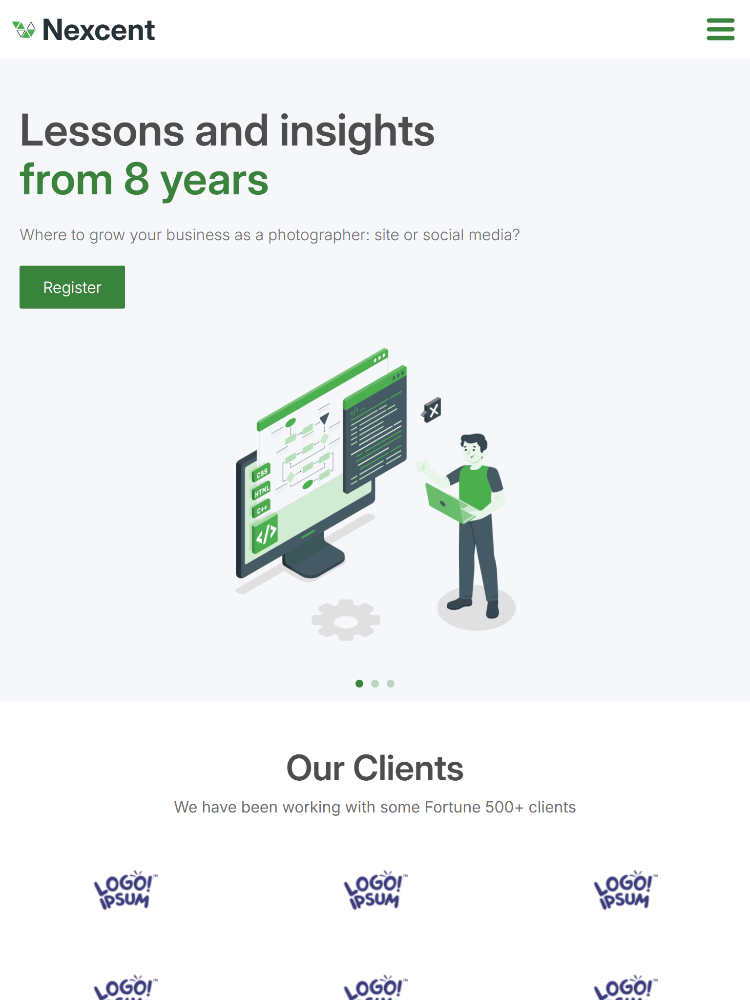

# Agency Landing Page

A modern responsive agency landing page built with HTML, CSS, and Tailwind from a Figma design.  

##  Live Demo
[View Site Here](https://alex-devonte.github.io/agency-landing-page/)

##  Tech Stack
- HTML5 
-  CSS 
- Tailwind CSS 
- JavaScript
 - Swiper.js (carousel)

## Design
- Based on a Figma design
- Fully responsive layout (mobile, tablet, desktop)
- Adjustments made for **accessibility**:
  - Improved color contrast for readability
  - Adjusted layout spacing for responsiveness
  
## Screenshots

| Mobile | Tablet | Desktop |
|--------|--------|---------|
|  |  |  |

## Design Reference
[Figma Design](https://www.figma.com/community/file/1222060007934600841/minimal-landing-page-design-website-home-page-design-agency-website-ui-design)  
